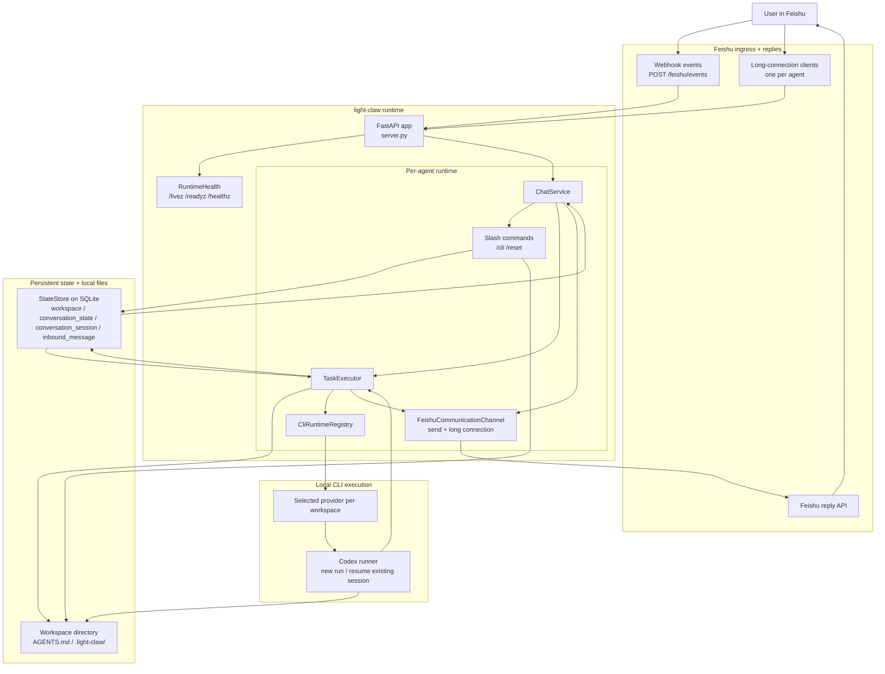

# light-claw

`light-claw` is a Python service for running long-lived coding agents behind Feishu on the same machine.

- Feishu webhook ingress + outbound reply API
- Persistent workspace/session state in SQLite
- One persistent workspace per agent
- One Feishu app/bot per agent
- One Feishu communication channel per agent in a single lightweight process
- One CLI provider selection per agent workspace
- Each workspace is bootstrapped with `AGENTS.md` and agent-local tool profile files
- CLI conversations resume on the same Feishu conversation until `/reset`

## What this MVP supports

- Feishu event webhook mode
- Feishu multi-agent long-connection mode on a single host
- Text conversations through the selected CLI provider
- Pluggable CLI provider registry, with Codex and Claude Code implemented plus a reserved custom CLI slot
- One shared runtime with multiple isolated agents:
  - independent Feishu app credentials
  - one dedicated workspace per agent
  - independent Codex sessions
  - independent local skills/MCP profile files
- Commands from Feishu:
  - `/cli list`
  - `/cli current`
  - `/cli use <provider>`
  - `/help`
  - `/reset`

## Architecture



How the pieces connect:

- Feishu messages enter through webhook mode or long-connection mode, but both paths end up in the same `ChatService`.
- `ChatService` either handles a slash command immediately or forwards the prompt to `TaskExecutor`.
- `TaskExecutor` is the single execution path for all prompts; session reuse and CLI execution all stay in one place.
- `server.py` stays focused on FastAPI entrypoints and Feishu request handling, while `runtime_services.py` owns runtime wiring, health state, and service lifecycle.
- `StateStore` in SQLite is the shared coordination layer for the single workspace bound to each agent, resumed CLI sessions, and inbound dedupe.
- Each workspace directory is the execution context: the CLI runs inside it and `.light-claw/` stores internal state.
- The selected CLI provider is stored on the agent workspace; today that includes Codex and Claude Code, and the registry keeps the runtime path adapter-based instead of hardcoded.

## Project layout

```text
src/light_claw/
  __init__.py
  __main__.py
  chat.py
  chat_commands.py
  commands.py
  communication/
    __init__.py
    base.py
    messages.py
    feishu.py
  config.py
  models.py
  runtime/
    __init__.py
    codex_cli.py
    claude_code.py
    registry.py
  runtime_services.py
  server.py
  store.py
  store_records.py
  task_executor.py
  workspaces.py
```

Runtime data is stored under `.data/` by default:

```text
.data/
  light-claw.db
  workspaces/
    <agent>/
      AGENTS.md
      .light-claw/
```

## Setup

1. Install dependencies with `uv`.

```bash
uv sync
```

2. Copy the env template.

```bash
cp .env.example .env
```

3. Fill in your Feishu credentials.

   Single-agent compatibility mode:
   - set `FEISHU_APP_ID`
   - set `FEISHU_APP_SECRET`
   - set `FEISHU_VERIFICATION_TOKEN` for webhook mode

   Multi-agent mode:
   - set `LIGHT_CLAW_AGENTS_FILE=examples/agents.example.json`
   - create one Feishu app per agent
   - store one `app_id` / `app_secret` / `verification_token` tuple per agent in that JSON file

   Optional runtime settings:
   - `CLAUDE_BIN=claude` sets the Claude Code CLI binary path.
   - `CLAUDE_MODEL=` optionally pins the default Claude model.
   - `CLAUDE_PERMISSION_MODE=bypassPermissions` controls Claude Code non-interactive permission handling.
   - `CLAUDE_ADD_DIRS=` adds extra directories Claude Code may access, separated by `:`.
   - `CODEX_STALL_TIMEOUT_SECONDS=120` fails stalled Codex runs.
   - `LIGHT_CLAW_INBOUND_MESSAGE_TTL_SECONDS=604800` controls dedupe retention.
   - `LIGHT_CLAW_STATUS_HEARTBEAT_SECONDS=30` controls progress heartbeat messages.
   - `LIGHT_CLAW_BASE_DIR=` pins the runtime base path for `systemd`.
   - In `LIGHT_CLAW_SANDBOX=full-auto`, `light-claw` enables outbound network access for Codex workspace-write sandbox commands.
   - `HTTP_PROXY` / `HTTPS_PROXY` / `ALL_PROXY` / `NO_PROXY` are forwarded into Codex sandboxed shell commands when set in the host environment.

4. Ensure the CLI providers you want to use are installed and can run non-interactively on this machine.

   - `codex` for the `codex` provider
   - `claude` for the `claude-code` provider

5. Start the server.

```bash
uv run light-claw
```

Or:

```bash
uv run uvicorn light_claw.server:create_app --factory --host 0.0.0.0 --port 8000
```

## Feishu app configuration

This MVP supports both Feishu delivery modes through `FEISHU_EVENT_MODE`.

### Webhook mode

Use `FEISHU_EVENT_MODE=webhook` when you want Feishu to call your HTTP server.

- Event subscription URL: `POST /feishu/events`
- Health checks:
  - `GET /livez`
  - `GET /readyz`
  - `GET /healthz`
  - `GET /healthz/details`
- Enable at least `im.message.receive_v1`
- With multiple agents, each agent uses its own verification token from `LIGHT_CLAW_AGENTS_FILE`
- Start with `uv run light-claw` or `uv run uvicorn light_claw.server:create_app --factory --host 0.0.0.0 --port 8000`

### Long-connection mode

Use `FEISHU_EVENT_MODE=long_connection` when you want the process to keep a websocket connection to Feishu.

- `FEISHU_VERIFICATION_TOKEN` is not required
- The process starts one long-connection-capable communication channel per configured agent
- The same process also serves local health endpoints on `HOST:PORT`
- Start with `uv run light-claw`
- Make sure the process is already running before saving the "use long connection" setting in the Feishu console
- Enable at least `im.message.receive_v1`

## Workspace behavior

The first user message automatically gets a default workspace if none exists.

Each workspace contains:

- `AGENTS.md`
- `.light-claw/agent.json`
- `.light-claw/skills.md`
- `.light-claw/mcp.md`

The selected CLI runs inside the selected workspace, so the workspace instructions and agent-local tool profile files are part of its local context.

Each configured agent maps to:

- one Feishu app/bot
- one isolated workspace namespace
- one independent Codex session scope
- one local skills/MCP profile

Each workspace also stores a selected CLI provider. The current implementation ships with:

- `codex`: implemented
- `claude-code`: implemented
- `custom`: reserved provider slot

That means the execution path is no longer hardcoded to Codex. Switching between Codex and Claude Code now happens at the workspace provider layer instead of a service-wide refactor.

Provider switch behavior stays intentionally simple: when a workspace switches between `codex` and `claude-code`, light-claw clears the workspace's saved CLI sessions before the next run so one provider never tries to resume the other's session ID.

## Notes

- This stays intentionally small: single machine, SQLite, local workspaces, one shared process.
- For multi-agent operation, prefer one Feishu app per agent instead of trying to multiplex multiple robot identities through one app.
- Feishu rich media and card actions can be layered on later.
- The runtime prefers `LIGHT_CLAW_SANDBOX`; it still accepts legacy `CODEX_CLAW_SANDBOX` and `CODEX_SANDBOX`, and maps host sandbox values like `workspace-write` to a safe Codex CLI mode.
- The default SQLite path is `.data/light-claw.db`; if `.data/codex-claw.db` already exists, the runtime keeps using it automatically.
- `DEFAULT_CLI_PROVIDER` controls the provider used for newly created agent workspaces.
- `uv sync` creates and manages the project's virtual environment automatically. Use `uv run ...` for local commands.

## systemd

A minimal service template is provided at `deploy/systemd/light-claw.service`.

Recommended single-host setup:

1. Set `WorkingDirectory` to the repository root.
2. Point `EnvironmentFile` at your `.env`.
3. Use `FEISHU_EVENT_MODE=long_connection`.
4. Point `LIGHT_CLAW_AGENTS_FILE` at your multi-agent JSON file.
5. Keep `HOST=127.0.0.1` and use `GET /readyz` for local readiness checks.
