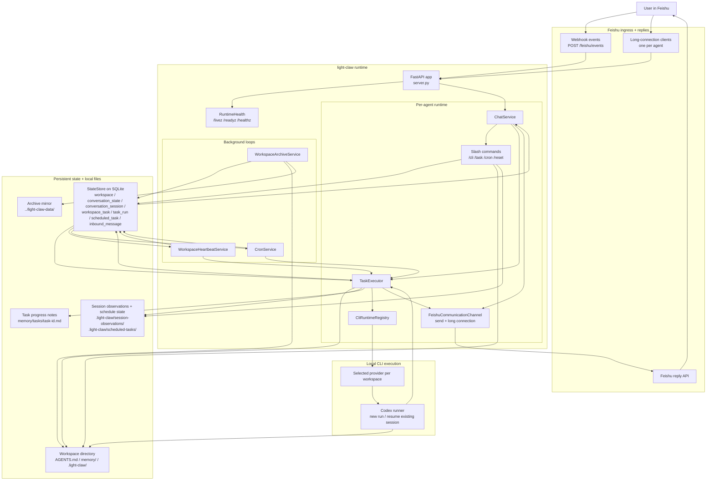

# light-claw

`light-claw` is a Python service for running long-lived coding agents behind Feishu on the same machine.

- Feishu webhook ingress + outbound reply API
- Persistent workspace/session state in SQLite
- One persistent workspace per agent
- One Feishu app/bot per agent
- One Feishu communication channel per agent in a single lightweight process
- One CLI provider selection per agent workspace
- Each workspace is bootstrapped with `AGENTS.md`, `memory/`, and agent-local tool profile files
- CLI conversations resume on the same Feishu conversation until `/reset`
- Workspace-scoped background tasks with SQLite-backed schedules and run history

## What this MVP supports

- Feishu event webhook mode
- Feishu multi-agent long-connection mode on a single host
- Text conversations through the selected CLI provider
- Pluggable CLI provider registry, with Codex implemented and reserved slots for Claude Code and custom CLIs
- One shared runtime with multiple isolated agents:
  - independent Feishu app credentials
  - one dedicated workspace per agent
  - independent Codex sessions
  - independent local skills/MCP profile files
- Commands from Feishu:
  - `/cli list`
  - `/cli current`
  - `/cli use <provider>`
  - `/archive current`
  - `/archive daily <HH:MM>`
  - `/help`
  - `/task list`
  - `/task status <id|index>`
  - `/task create <prompt>`
  - `/task cancel <id|index>`
  - `/cron list`
  - `/cron every <seconds> <task_id>`
  - `/cron remove <id|index>`
  - `/reset`

## Architecture



How the pieces connect:

- Feishu messages enter through webhook mode or long-connection mode, but both paths end up in the same `ChatService`.
- `ChatService` either handles a slash command immediately or forwards the prompt to `TaskExecutor`.
- `TaskExecutor` is the single execution path for foreground chat, heartbeat-resumed tasks, and cron-triggered tasks, so session reuse, observations, memory guidance, and CLI execution all stay in one place.
- `server.py` now stays focused on FastAPI entrypoints and Feishu request handling, while `runtime_services.py` owns runtime wiring, health state, and background service lifecycle.
- `StateStore` in SQLite is the shared coordination layer for the single workspace bound to each agent, resumed CLI sessions, background task definitions, run history, schedules, and inbound dedupe.
- Each workspace directory is both execution context and long-term memory: the CLI runs inside it, `memory/` persists user/project knowledge, and `.light-claw/` stores internal state such as observations and schedule no-change tracking.
- Background services do not execute work themselves; they only decide when work should run, then call back into the same `TaskExecutor`.
- The selected CLI provider is stored on the agent workspace; today that means Codex, but the registry keeps the runtime path adapter-based instead of hardcoded.
- The archive service is deliberately separate from task execution: it mirrors every known agent workspace for backup/debugging, but it does not participate in prompt construction.

## Project layout

```text
src/light_claw/
  __init__.py
  __main__.py
  archive_sync.py
  chat.py
  chat_commands.py
  communication/
    __init__.py
    base.py
    messages.py
    feishu.py
  commands.py
  config.py
  cron.py
  heartbeat.py
  memory/
    __init__.py
    guidance.py
    paths.py
    session_observations.py
    task_progress.py
  models.py
  runtime/
    __init__.py
    codex_cli.py
    registry.py
  runtime_services.py
  schedule_state.py
  server.py
  store.py
  store_records.py
  task_commands.py
  task_executor.py
  workspaces.py
```

Runtime data is stored under `.data/` by default:

```text
.data/
  light-claw.db
  workspaces/
    <agent>/
      AGENTS.md
      .light-claw/
      memory/
```

Workspace content is also archived to a sibling `light-claw-data/` directory by default:

```text
../light-claw-data/
  workspaces/
    <agent>/
      AGENTS.md
      .light-claw/
      memory/
```

The service performs one archive sync during startup and then repeats every 12 hours by default. You can also switch it to a fixed daily backup time with `/archive daily <HH:MM>`, which is stored in SQLite and applied to all agent workspaces.

## Setup

1. Install dependencies with `uv`.

```bash
uv sync
```

2. Copy the env template.

```bash
cp .env.example .env
```

3. Fill in your Feishu credentials.

   Single-agent compatibility mode:
   - set `FEISHU_APP_ID`
   - set `FEISHU_APP_SECRET`
   - set `FEISHU_VERIFICATION_TOKEN` for webhook mode

   Multi-agent mode:
   - set `LIGHT_CLAW_AGENTS_FILE=examples/agents.example.json`
   - create one Feishu app per agent
   - store one `app_id` / `app_secret` / `verification_token` tuple per agent in that JSON file

   Optional archive settings:
   - `LIGHT_CLAW_ARCHIVE_ENABLED=true` enables workspace archive sync.
   - `LIGHT_CLAW_ARCHIVE_DIR=` defaults to a sibling `light-claw-data` directory when empty.
   - `LIGHT_CLAW_ARCHIVE_INTERVAL_SECONDS=43200` controls the sync interval.
   - `LIGHT_CLAW_INBOUND_MESSAGE_TTL_SECONDS=604800` controls dedupe retention.

   Optional runtime settings:
   - `CODEX_STALL_TIMEOUT_SECONDS=120` fails stalled Codex runs.
   - `LIGHT_CLAW_TASK_HEARTBEAT_ENABLED=true` enables workspace task progression scans.
   - `LIGHT_CLAW_TASK_HEARTBEAT_INTERVAL_SECONDS=1800` controls how often running tasks are resumed.
   - `LIGHT_CLAW_CRON_ENABLED=true` enables scheduled task polling.
   - `LIGHT_CLAW_CRON_POLL_INTERVAL_SECONDS=60` controls the cron polling interval.
   - `LIGHT_CLAW_STATUS_HEARTBEAT_SECONDS=30` controls progress heartbeat messages.
   - `LIGHT_CLAW_BASE_DIR=` pins the runtime base path for `systemd`.
   - In `LIGHT_CLAW_SANDBOX=full-auto`, `light-claw` enables outbound network access for Codex workspace-write sandbox commands.
   - `HTTP_PROXY` / `HTTPS_PROXY` / `ALL_PROXY` / `NO_PROXY` are forwarded into Codex sandboxed shell commands when set in the host environment.

4. Ensure `codex` is installed and can run non-interactively on this machine.

5. Start the server.

```bash
uv run light-claw
```

Or:

```bash
uv run uvicorn light_claw.server:create_app --factory --host 0.0.0.0 --port 8000
```

## Feishu app configuration

This MVP supports both Feishu delivery modes through `FEISHU_EVENT_MODE`.

### Webhook mode

Use `FEISHU_EVENT_MODE=webhook` when you want Feishu to call your HTTP server.

- Event subscription URL: `POST /feishu/events`
- Health checks:
  - `GET /livez`
  - `GET /readyz`
  - `GET /healthz`
  - `GET /healthz/details`
- Enable at least `im.message.receive_v1`
- With multiple agents, each agent uses its own verification token from `LIGHT_CLAW_AGENTS_FILE`
- Start with `uv run light-claw` or `uv run uvicorn light_claw.server:create_app --factory --host 0.0.0.0 --port 8000`

### Long-connection mode

Use `FEISHU_EVENT_MODE=long_connection` when you want the process to keep a websocket connection to Feishu.

- `FEISHU_VERIFICATION_TOKEN` is not required
- The process starts one long-connection-capable communication channel per configured agent
- The same process also serves local health endpoints on `HOST:PORT`
- Start with `uv run light-claw`
- Make sure the process is already running before saving the "use long connection" setting in the Feishu console
- Enable at least `im.message.receive_v1`

## Workspace behavior

The first user message automatically gets a default workspace if none exists.

Each workspace contains:

- `AGENTS.md`
- `.light-claw/agent.json`
- `.light-claw/skills.md`
- `.light-claw/mcp.md`
- `memory/CLAUDE.md`
- `memory/daily/`
- `memory/tasks/` (created on demand)

The selected CLI runs inside the selected workspace, so the workspace instructions, memory files, and agent-local tool profile files are part of its local context. `light-claw` now follows a happyclaw-style split: durable memory lives in `memory/CLAUDE.md`, while short-lived dated notes live under `memory/daily/YYYY-MM-DD.md`.

`light-claw` also keeps a small per-session observation queue in the workspace. The next prompt for that conversation prepends any queued observations, such as workspace file changes, mutating command results, background task updates, and previous runtime failures. Workspace file changes are still computed from the last recorded snapshot, but they now flow through the same observation path as the other session events.

Archive control stays global instead of becoming a background task. `/archive current` shows the active archive schedule, and `/archive daily <HH:MM>` switches the archive loop to one backup per day at that server-local time. The archive loop still does one sync on startup, and the configured daily time applies to every known agent workspace.

Each configured agent maps to:

- one Feishu app/bot
- one isolated workspace namespace
- one independent Codex session scope
- one local skills/MCP profile

Each workspace also stores a selected CLI provider. The current implementation ships with:

- `codex`: implemented
- `claude-code`: reserved provider slot
- `custom`: reserved provider slot

That means the execution path is no longer hardcoded to Codex. Adding Claude Code later is now an adapter task instead of a service-wide refactor.

## Task system

Each workspace can now keep long-running task definitions in SQLite. A task stores the prompt, last result summary, next heartbeat time, and the Feishu reply target that should receive background updates.

Minimal task commands:

- `/task list`
- `/task status <id|index>`
- `/task create <prompt>`
- `/task cancel <id|index>`
- `/cron list`
- `/cron every <seconds> <task_id>`
- `/cron remove <id|index>`

Execution model:

- normal chat messages still run immediately in the agent's single workspace
- `TaskExecutor` reuses the same CLI runner abstraction for chat, cron, and heartbeat-triggered runs
- `/task create` acknowledges the task immediately and also kicks off the first background run right away instead of waiting for the next heartbeat tick
- `WorkspaceHeartbeatService` periodically resumes running workspace tasks
- `CronService` triggers scheduled task runs and records the next due time in SQLite
- background task runs keep lightweight progress notes under `memory/tasks/<task_id>.md`
- cron-triggered runs automatically review `memory/` and the task progress note before continuing
- cron schedules stop themselves after repeated no-change results so they do not keep reporting the same completion forever
- service startup recovers orphaned `running` task runs from a previous process so cron and heartbeat can claim those tasks again instead of spinning forever

## Notes

- This stays intentionally small: single machine, SQLite, local workspaces, local archive, one shared process.
- For multi-agent operation, prefer one Feishu app per agent instead of trying to multiplex multiple robot identities through one app.
- Feishu rich media and card actions can be layered on later.
- The gateway reference repo already shows the broader direction for reminders, richer transports, browser MCP, and skill management.
- The runtime prefers `LIGHT_CLAW_SANDBOX`; it still accepts legacy `CODEX_CLAW_SANDBOX` and `CODEX_SANDBOX`, and maps host sandbox values like `workspace-write` to a safe Codex CLI mode.
- The default SQLite path is `.data/light-claw.db`; if `.data/codex-claw.db` already exists, the runtime keeps using it automatically.
- Workspace archives default to `../light-claw-data/workspaces`, with one sync at startup and then every 12 hours.
- `DEFAULT_CLI_PROVIDER` controls the provider used for newly created agent workspaces.
- `uv sync` creates and manages the project's virtual environment automatically. Use `uv run ...` for local commands.

## systemd

A minimal service template is provided at `deploy/systemd/light-claw.service`.

Recommended single-host setup:

1. Set `WorkingDirectory` to the repository root.
2. Point `EnvironmentFile` at your `.env`.
3. Use `FEISHU_EVENT_MODE=long_connection`.
4. Point `LIGHT_CLAW_AGENTS_FILE` at your multi-agent JSON file.
5. Keep `HOST=127.0.0.1` and use `GET /readyz` for local readiness checks.
